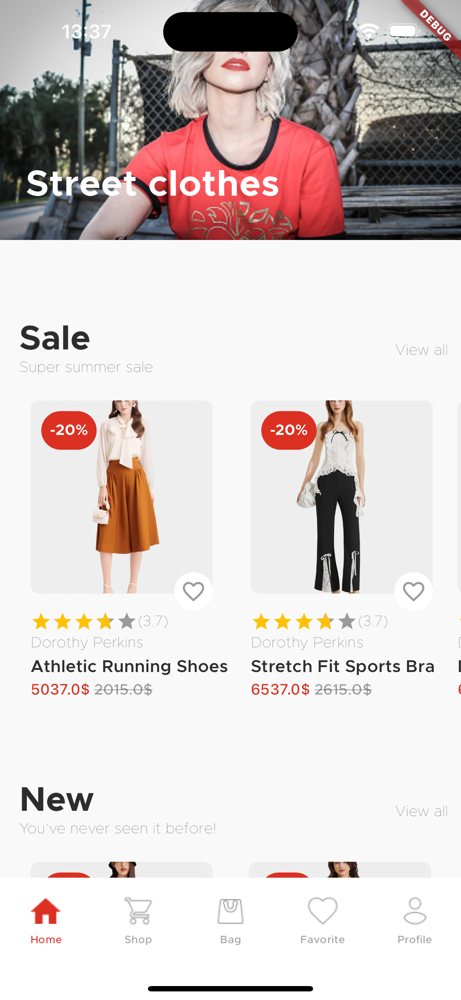
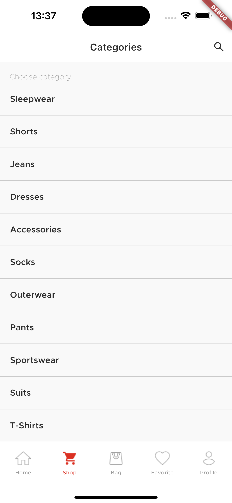
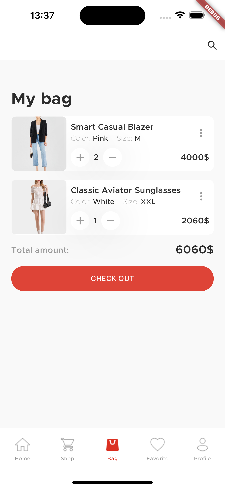
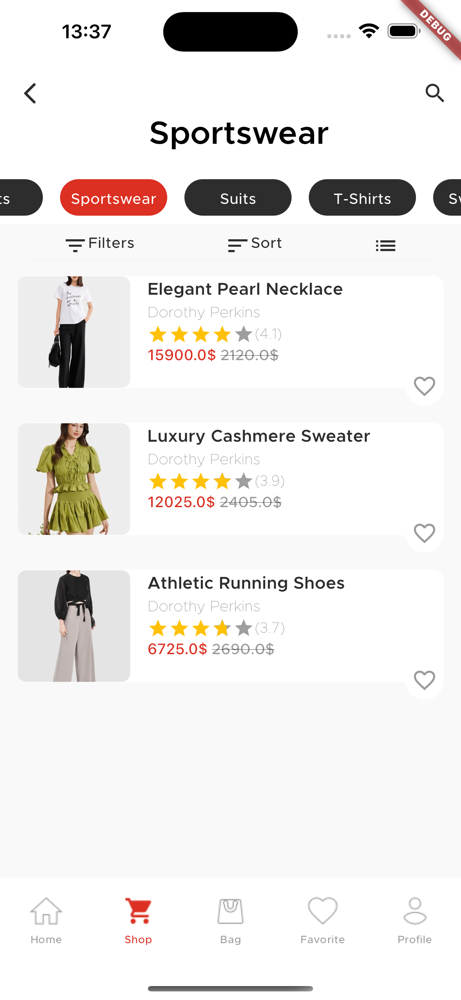
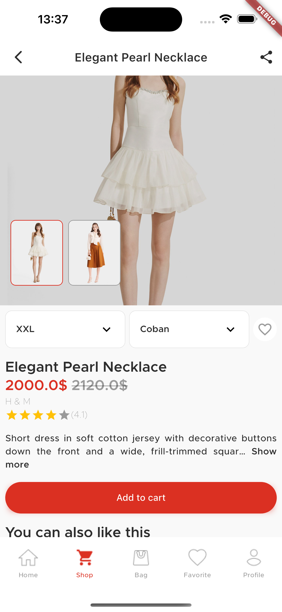
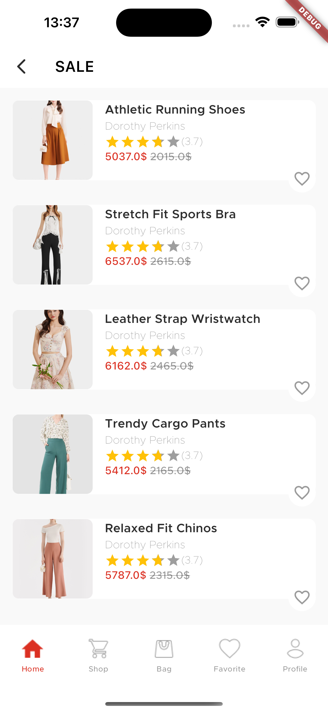

# E-commerce Mobile Application
E-Commerce is an application built to provide users with an easy, secure and fast experience when shopping online through a strong operating and payment support system.
Design: <a href="https://www.figma.com/file/arYXBvjg4dgjeS3cdFwSKO/E-commerce-Application-by-Fively-%2F-Light-Version-(Copy)?node-id=552%3A0">Figma E-Commerce</a> 

   
# Screeenshot
| Home| Shop| Cart|
|-------------------------------------------------| ---------------------------------------------------- | -------------------------------------------------- |
|  |  |  
| <p align="center"><strong>Product Oveview</strong></p> | <p align="center"><strong>Product Detail</strong></p> |<p align="center"><strong>View all</strong></p> |
||||


# Functions To Do
- Signin
- Signup
- Forgot password
- Resset password
- Add, remove to favorite
- Checkout
- Notification
- Add, remove to favorite
- Add, remove payment method
- Add, remove address shipping
- Change information profile
- Add your review

# Code structure
Here is the core folder structure which flutter provides.
```
flutter-app/
|- android
|- assets
|- ios
|- lib
|- web
|- test
```
Here is the folder structure I have been using in this project
```
lib/
|- src/
  |- features/
    |- account
    |- authentication
    |- cart
    ...
  |- router/
  |- services/
  |- themes/
  |- network/
    |- blod
    |- data
        |- user
        |- sign
        |- product
        ...
    |- firebase
    |- models
    |- domain_manager.dart
  |- widgets/
|- main.dart

```

# Depencencies
### Helper
- [shared_preferences](https://pub.dev/packages/shared_preferences): Flutter plugin for reading and writing simple key-value pairs. Wraps NSUserDefaults on iOS and SharedPreferences on Android.
- [go_router](): provide a convenient, url-based API for navigating between different screens.
- [get_it](): This is a simple Service Locator
- [intl](): This package provides internationalization and localization facilities, including message translation, plurals and genders, date/number formatting and parsing, and bidirectional text.
- [logger](): Small, easy to use and extensible logger which prints beautiful logs.

## API
- [retrofit](): For working with restful API, generated model
- [freezed]()

## Database
- [cloud_firestore]()

## Authentication
- [firebase_auth]()

## State management
- [flutter_bloc](https://pub.dev/packages/flutter_bloc): Widgets that make it easy to integrate blocs and cubits into Flutter
  
## Flutter Gen
- [flutter_gen_runner]()

## Widget
- [shimmer](): Animate image place holder
- [readmore]()
- [flutter_rating_bar]()

## Image
- [image_picker]():
- [cached_network_image]()


## Environment
- [flutter_dotenv]()

